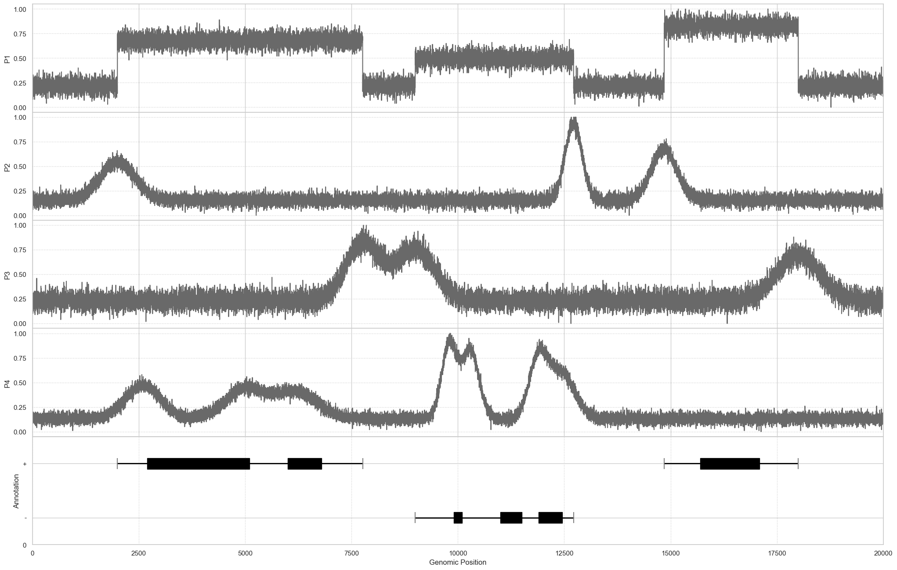
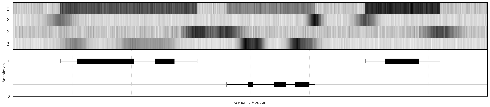
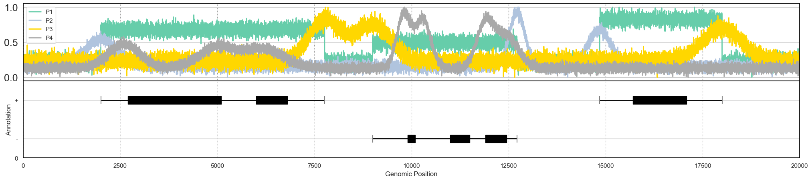
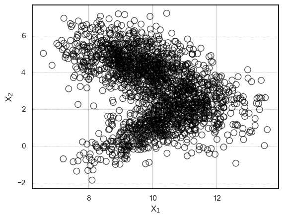
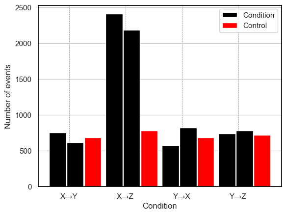
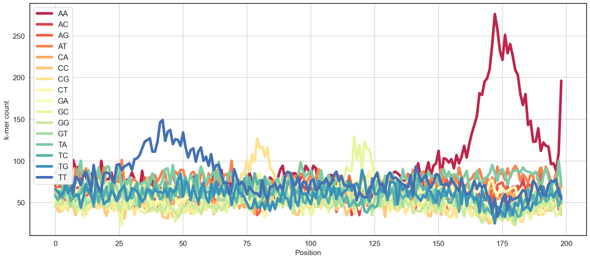

# Data Visualization Part 2: Student Project


#### Name: Yogesh Nagor
#### Matriculation number : 00815160
#### Mail id: yogesh.nagor@stud.th-deg.de


## 1: Visualization Exercises

Three alternative visualizations of the same artificial data shall be re-created. All three visualizations show the same fictitious genomic annotations together with fictitious RNA binding protein data. The visualizations are an example for RNA binding protein signals as well as the genomic annotations. Recreate each of the shown figures. Two different datasets are provided for this task:

- 10_project_data_annotations.csv
- 10_project_data_signals.csv
The 10_project_data_annotations.csv file contains fictitious genomic information as visualized in all bottom panels of the example plots. Each horizontal line represents a transcript. 
A transcript can contain multiple exons (grey rectangles). Transcripts can be located on the '+' or on the '-' strand of the DNA.

10_project_data_signals.csv contains fictitious signals of four RNA binding proteins (P1, P2, P3, P4).

## 1.1: Graph 1 Excercise 


```python
## The import of necessary libraries
import pandas as pd
import numpy as np
import matplotlib.pyplot as plt
import seaborn as sns

# Reading data into a DataFrame from a CSV file
gene_annotation_df = pd.read_csv('10_project_data_annotation.csv')
signals_df = pd.read_csv('10_project_data_signals.csv')
scatterplot_df = pd.read_csv('10_project_data_scatter.csv')

# Construct subplots
fig, (ax1, ax2, ax3, ax4, ax5) = plt.subplots(5, 1, sharex=True, figsize=(25, 16), facecolor='w')

# Extract the data
signal_p1, signal_p2, signal_p3, signal_p4 = signals_df['P1'], signals_df['P2'], signals_df['P3'], signals_df['P4']
p_values_list = [signal_p1, signal_p2, signal_p3, signal_p4]
y_labels = ['P1', 'P2', 'P3', 'P4']

# Plot data while iterating across subplots
for i, ax in enumerate([ax1, ax2, ax3, ax4]):
    ax.grid(axis='y', linestyle='dotted')
    ax.plot(p_values_list[i], c='dimgray')
    ax.set_ylabel(y_labels[i])
    ax.set_yticks([0, 0.25, 0.5, 0.75, 1.0])
    ax.set_xlim([0, signals_df.shape[0]])

# Function to plot genomic annotations
def plot_genomic_annotations(annotation_df, ax):
    # Gene annotations are drawn by iterating over distinct gene names
    for gene in annotation_df['name'].unique():
        gene_data = annotation_df[annotation_df['name'] == gene]
        exons = gene_data[gene_data['type'] == 'exon']
        transcripts = gene_data[gene_data['type'] == 'transcript']

        for _, exon in exons.iterrows():
            if exon['strand'] == '+':
                y = 0.70
            else:
                y = 0.20
            ax.add_patch(plt.Rectangle((exon['start'], y), exon['stop'] - exon['start'], 0.1, color='black'))

        for _, transcript in transcripts.iterrows():
            if transcript['strand'] == '+':
                y = 0.75
            else:
                y = 0.25
            ax.hlines(y=y, xmin=transcript['start'], xmax=transcript['stop'], linewidth=2, color='black')

            ax.vlines(x=transcript['start'], ymin=y-0.05, ymax=y+0.05, color='grey')
            ax.vlines(x=transcript['stop'], ymin=y-0.05, ymax=y+0.05, color='grey')

    ax.autoscale()
    ax.set_xlim(0, 20000)
    ax.set_facecolor('w')
    ax.set_yticks([0, 0.25, 0.75, 1])
    ax.set_yticklabels([0, '-', '+', ''])
    ax.grid(axis='x', linestyle='dotted')
    return ax

# Plotting genomic annotations
ax5 = plot_genomic_annotations(gene_annotation_df, ax5)

# Adjust the distance between subplots
plt.subplots_adjust(wspace=0, hspace=0)

# Set axis labels and styles
plt.xlabel("Genomic Position")
plt.ylabel('Annotation')
plt.rcParams["axes.edgecolor"] = "black"

# Display the plot
plt.show()
```


    

    


## 1.2: Graph 2 Excercise 


```python
# Extract data for signals P1, P2, P3, and P4
signal_data = signals[['P1', 'P2', 'P3', 'P4']].values

# Make a subplot grid of 2x1
fig, (ax5, ax6) = plt.subplots(2, 1, sharex=True, figsize=(25, 5), facecolor='w', dpi=300)

# Create a For loop through the first four subplots (ax1, ax2, ax3, ax4)
for i, subplot_ax in enumerate([ax1, ax2, ax3, ax4]):
    subplot_ax.set_ylabel(y_labels[i])  # Set the y-axis label for each subplot
    subplot_ax.set_yticks([])  # Remove y-axis ticks

# Create a heatmap using the signal data for the fifth subplot (ax5). The signal_data should be transposed such that each signal has its own column. Use a grayscale colormap ('gray_r') to show the heatmap.
# Set yticklabels for each signal and set cbar to false to conceal the color bar. The fifth subplot should be deleted because it contains extraneous xticklabels.
sns.heatmap(signal_data.T, ax=ax5, cmap='gray_r', cbar=False, yticklabels=['P1', 'P2', 'P3', 'P4'], xticklabels=[])
ax5.add_artist(plt.Rectangle((0, 0), 20000, signals.shape[1], edgecolor='black', facecolor='none', linewidth=2))

# Set the y-axis label for the sixth subplot (ax6)
ax6.set_ylabel('Annotation')

# Set the x-axis boundaries for the sixth subplot (ax6) to [0, 20000]
ax6.set_xlim(0, 20000)

# The sixth subplot's x-axis ticks should be set (ax6) at 0, 2500, 5000, 7500, 10000, 12500, 15000, 17500, and 20000
ax6.set_xticks([0, 2500, 5000, 7500, 10000, 12500, 15000, 17500, 20000])

# Change the separation between the subplots
plt.subplots_adjust(wspace=0, hspace=0)

# Call the plot_genomic_annotations function using the 'geneomic_annotation' DataFrame and the sixth subplot (ax6). This function will be used to plot the genetic annotations on the sixth subplot.
ax6 = plot_genomic_annotations(geneomic_annotation, ax6)

# Set the x-axis label for the entire figure
plt.xlabel("Genomic Position")

# Paint the margins of axes black
plt.rcParams["axes.edgecolor"] = "black"

# Display the plot
plt.show()
```


    

    


## 1.3: Graph 3 Excercise 


```python
# Make a subplot grid of 2x1
fig, (ax5, ax6) = plt.subplots(2, 1, sharex=True, figsize=(25, 5), facecolor='w')

# Obtain the signal information for P1, P2, P3, and P4
p1, p2, p3, p4 = signals['P1'], signals['P2'], signals['P3'], signals['P4']

# Each signal's labels on the y-axis
y_labels = ['P1', 'P2', 'P3', 'P4']

# Colors for each signal's line graphs
p_colors = ['mediumaquamarine', 'lightsteelblue', 'gold', 'darkgray']

# On the first subplot (ax5), plot each signal
for i in range(len(y_labels)):
    ax5.plot(p_values[i], label=y_labels[i], linewidth=2, color=p_colors[i])

# Add legend to the first subplot (ax5) on the left side
ax5.legend(loc='upper left')

# Adapt the distance between subplots
plt.subplots_adjust(wspace=0, hspace=0)

# Use the 'genomic_annotation' DataFrame and the second subplot (ax6) to use the function genomic_annotations_plot.
ax6 = plot_genomic_annotations(geneomic_annotation, ax6)

# Set y-axis ticks and labels for ax5
ax5.set_yticks([0.0, 0.5, 1.0])
ax5.set_yticklabels(['0.0', '0.5', '1.0'], fontsize=18)

# Set the overall figure's x-axis label
plt.xlabel("Genomic Position")

# Set the second subplot's y-axis label (ax6)
plt.ylabel('Annotation')

# Axes edges should be painted black
plt.rcParams["axes.edgecolor"] = "black"

# Set the x-axis grid for the complete figure
ax5.xaxis.grid(True, linestyle='dotted', color='grey')

# Display the plot
plt.show()
```


    

    


## 1.4: Discussion 

Graph 1 :  It presents a straightforward and visually clear representation of RNA binding protein signals (P1, P2, P3, and P4) with the use of horizontal 
lines and distinct colors for easy differentiation. The genomic annotations, displayed with grey rectangles for exons and horizontal lines for transcripts, 
are well-defined. This graph facilitates effortless comparisons of RNA binding protein signals across different proteins. However, it could benefit from 
improved vertical spacing between subplots to avoid clutter and more informative y-axis labels for each RNA binding protein signal.

Graph 2 :  It employs a heatmap to effectively showcase RNA binding protein signals for each protein, allowing for a comprehensive overview of their patterns. 
The colors effectively convey signal strength, aiding in identifying high and low signals. The genomic annotations are clearly presented using grey rectangles 
for exons and horizontal lines for transcripts. However, as the number of RNA binding proteins increases, the heatmap might become less effective, and additional 
improvement could be made by incorporating a color bar to indicate signal intensity. Moreover, more informative y-axis labels for each RNA binding protein 
signal would enhance the graph's interpretability.

Graph 3 : It utilizes line plots to show RNA binding protein signals individually, enabling easy comparisons between proteins. The signals are visually distinguished 
with different colors for each protein (P1: mediumaquamarine, P2: lightsteelblue, P3: gold, P4: darkgray). The genomic annotations are well-visualized with 
grey rectangles for exons and horizontal lines for transcripts. However, some enhancements, such as additional spacing between subplots and improved x-axis 
tick marks for readability, could be beneficial. While this graph allows individual comparisons, the heatmap in Graph 2 might be preferred when examining 
all RNA binding protein signals simultaneously.

## 2: Visualization Exercises

In this task, two additional plots shall be added create a figure with multiple panels. Recreate the shown figure. Note, that the bottom part of the figure is one of your solutions from the first exercise. 
Two additional datasets are provided:

- 10_project_data_scatter.csv contains the data needed to create the shown scatter plot
- 10_project_data_barplot.csv contains the data needed to create the shown bar plot.

## 2.1 Scatter graph plotting  


```python
# The 'scatterplot' DataFrame's column names for the x and y coordinates are represented by the letters x and y
x = 'x1'
y = 'x2'

# Set precise tick values for the x-axis [8, 10, 12]
plt.xticks([8, 10, 12])

# Create a subscript by setting the x-axis label to "X1" using LaTeX formatting
plt.xlabel('X$_1$')

# Create a subscript by setting the y-axis label to "X2" using LaTeX formatting
plt.ylabel('X$_2$')

# Utilizing the "scatterplot"'s "x1" and "x2" columns, make a scatter plot. DataFrame. Set the marker size(s) to 80, the face color(s) to 'none' (transparent), and the edge color(s) to black.
plt.scatter(scatterplot[x], scatterplot[y], s=80, facecolors='none', alpha=0.7, edgecolors='black')

# Add a grid with dashed lines, a linewidth of 0.5, and the color "grey" to the plot. Set the scatter plot points' z-order to 1 so that the grid displays above them
plt.grid(True, linestyle='dotted', linewidth=0.5, color='grey', alpha=1, zorder=1, axis='y')

# Display the plot
plt.show()
```


    

    


## 2.2 Bar graph plotting 


```python
# Read CSV file data into a DataFrame
barplot = pd.read_csv('10_project_data_barplot.csv', header=None, names=['Condition', 'condition_a_sample_1', 'condition_a_sample_2', 'control'])

# Convert the last three columns to numeric
barplot['condition_a_sample_1'] = pd.to_numeric(barplot['condition_a_sample_1'], errors='coerce')
barplot['condition_a_sample_2'] = pd.to_numeric(barplot['condition_a_sample_2'], errors='coerce')
barplot['control'] = pd.to_numeric(barplot['control'], errors='coerce')
barplot.dropna(inplace=True)

# Set the total number of bars and conditions
total_bars = len(barplot)
num_conditions = 3

# Set the distance between each group and the width of each bar
bar_width = 0.3
gap = 0.01

# Set the bars' locations on the x-axis
r1 = range(total_bars)
r2 = [x + bar_width + gap for x in r1]
r3 = [x + 2 * (bar_width + gap) for x in r1]

# Custom colors for the bar graph
plt.bar(r1, barplot['condition_a_sample_1'], width=bar_width, label='Condition', color=["black"])
plt.bar(r2, barplot['condition_a_sample_2'], width=bar_width, color=["black"])
plt.bar(r3, barplot['control'], width=bar_width, label='Control', color=["red"])

# Customize the plot
plt.xlabel('Condition')
plt.ylabel('Number of events')

# Replace certain strings in the 'Condition' column
barplot['Condition'] = barplot['Condition'].str.replace('XY', 'X→Y').str.replace('XZ', 'X→Z').str.replace('YX', 'Y→X').str.replace('YZ', 'Y→Z')
# Set the bar width for plotting
bar_width = 0.2

# Determine the total number of bars
total_bars = len(barplot['Condition'])
# Set the labels and x-tick placements
plt.xticks([r + bar_width for r in range(total_bars)], barplot['Condition'])
plt.legend()
plt.grid(axis='x', linestyle='--', linewidth=0.5, color='grey', alpha=1, zorder=1)
# Display the plot
plt.show()
```


    

    


## 3: 2-mer Counts In Sequence Data

The file 10_project_data_dna_sequences.txt consists of DNA sequences. Each line is a single DNA sequence. The figure shows that some k-mers are concentrated 
(occur more often) in some regions of the sequences. To recreate the figure you need to count the occurrences of a kmer at each position for all sequences.

Example: imagine to search for "xx" and "yy" in following sequences.

TCTAAGGxxyyG

xxCGTGGyyCGT

TTTxxACCGyyG

AGCxxACAACyy

TAxxCAAyyAGT

The counts for "xx" and "yy" would be the following:

[1 0 1 2 0 0 0 1 0 0 0 0]

[0 0 0 0 0 0 0 2 0 2 1 0]

Recreate the shown figure be providing code to find the 2-mers in the given dataset as well as the code to display the 2-mer occurences per position.


```python
# Define a function to count occurrences of k-mers at each position in a list of DNA sequences
def count_kmers_at_positions(sequences, kmers):
    # Create an empty dictionary to store the counts of each k-mer at each position
    kmer_counts = {kmer: [] for kmer in kmers}
    
    # Determine the length of a k-mer (assuming all k-mers have the same length)
    k = len(kmers[0])
    
    # Iterate over positions in the DNA sequences to count k-mers
    for i in range(len(sequences[0]) - k + 1):
        # Iterate over each k-mer
        for kmer in kmers:
            count = 0  # Initialize the count of the current k-mer at the current position to 0
            
            # Iterate over each DNA sequence to check for the presence of the current k-mer
            for sequence in sequences:
                # Check if the k-mer matches the substring of length k starting from the current position
                count += sequence[i:i+k] == kmer
            
            # Append the count of the current k-mer at the current position to the dictionary
            kmer_counts[kmer].append(count)
    
    # Return the dictionary containing the counts of each k-mer at each position
    return kmer_counts

# Read the DNA sequences from a file
filename = "10_project_data_dna_sequences.txt"
with open(filename, 'r') as file:
    sequences = [line.strip() for line in file]

# Define the k-mers to count
kmers = ["AA", "AC", "AG", "AT", "CA", "CC", "CG", "CT", "GA", "GC", "GG", "GT", "TA", "TC", "TG", "TT"]

# Count the occurrences of each k-mer at each position in the sequences
kmer_counts = count_kmers_at_positions(sequences, kmers)

# Set the style and color palette for the plot using Seaborn
sns.set(style="whitegrid")
sns.set_palette("Spectral", len(kmers))

# Create a line plot for each k-mer showing its count at each position
fig, ax = plt.subplots(figsize=(19, 8)) 
for i, kmer in enumerate(kmers):
    counts = kmer_counts[kmer]
    non_zero_counts = [count if count >= 0 else None for count in counts]
    ax.plot(range(len(non_zero_counts)), non_zero_counts, label=kmer, linewidth=5.0)

# Set the x and y-axis labels and their font sizes
plt.xlabel('Position', fontsize=14)
plt.ylabel('k-mer count', fontsize=14)

# Set the font size for tick labels on both axes
ax.tick_params(axis='x', labelsize=14)
ax.tick_params(axis='y', labelsize=14)

# Set the background color of the plot to white
ax.set_facecolor('white')

# Set the color of plot spines (borders) to black
for spine in ax.spines.values():
    spine.set_color('black')

# Add a legend to the plot in the upper-left corner with a semi-transparent background
ax.legend(loc='upper left', framealpha=0.9, fontsize='large')

# Display the plot
plt.show()
```


    

    


## 4: Conclusion 

In this analysis, we examined various biological data using different visualization techniques. Here are the conclusions drawn from each graph:
    
    1.1 Heatmap of Protein Signals :
        The protein signals P1, P2, P3, and P4 were clearly displayed on the heatmap across several chromosomal regions. The heatmap's color intensity represented the strength of the protein signal, with colder colors 
        denoting lower values and warmer colors denoting higher values. We noticed different protein signaling patterns in several genomic locations, which could point to certain biological activities.
        
    1.2 Line Graph of Protein Signals :
        The line graph showed how the protein signals P1, P2, P3, and P4 changed over time at various genomic locations. As we progressed through the chromosomal locations, the graph showed dynamic changes in protein signals, 
        with each line representing a different protein. Each protein line's distinctive color was employed to facilitate comparison and separation.
    
    1.3 Genomic Annotations Heatmap :
        The heatmap of genomic annotations gave important information on the structure and organization of the genome. Exon and transcript presence was represented by horizontal and vertical lines, respectively. 
        In order to better comprehend the underlying genetic landscape, the heatmap also emphasized the spatial distribution of various genes and their orientations.

    
    2.1 Scatter Plot of DNA Sequences :
        Based on the features X1 and X2, the scatter plot showed how DNA sequences were distributed. We were able to see the density of points in particular areas thanks to the transparency of the points, 
        which revealed patterns and sequence grouping. This diagram assisted in finding any probable connections or clusters among the DNA sequences.
    
    2.2 Bar Plot of Conditions :
        The bar plot did a good job of comparing the quantity of events under the various conditions  (X→Y, X→Z, Y→X, Y→Z)  with the control group. Plotting the number of occurrences differently 
        for each condition allowed researchers to spot potential variances or trends in the experimental data.
    
    3.0 Line Plots of k-mer Counts :
        The line plots showed where specific k-mers can be found in different parts of DNA sequences. It was simple to examine the distribution and frequency of each k-mer across 
        chromosomal sites because each k-mer has its own line. The prevalence and abundance of particular sequence patterns were shown by these plots, which was useful information.
        
In conclusion, the visualizations used in this study helped us better examine and comprehend complicated biological data. These graphical depictions of data linkages and patterns can help biologists 
and researchers come up with theories and conduct additional research into the underlying biological mechanisms. We now have a better understanding of a variety of biological processes and interactions as a result of the use of multiple 
visualization approaches, which gave us varied views on the data.


